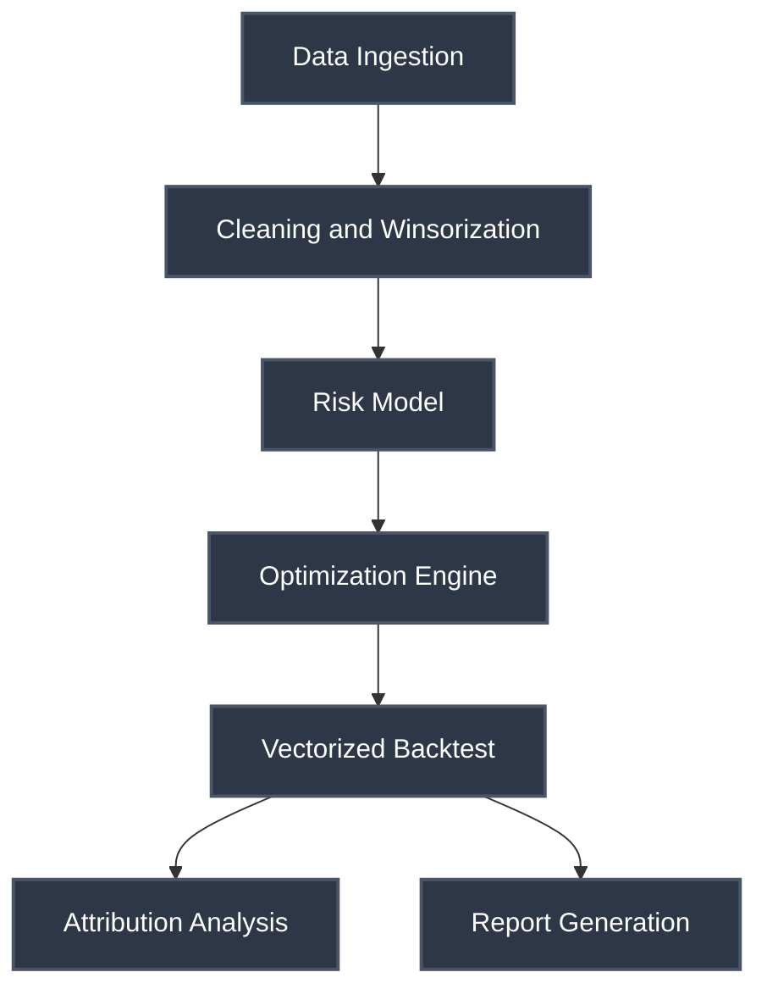

# GammaEdge


[](https://gammaedge.streamlit.app)


> Python platform for institutional portfolio optimization, risk analytics, and backtesting.

Portfolio optimization and backtesting framework implementing modern quantitative methods. Includes covariance shrinkage, Random Matrix Theory filtering, multiple optimization engines, and vectorized backtesting with realistic transaction costs.

The implementation prioritizes numerical stability and addresses common issues with sample covariance matrices in limited time series. We use a multi-step fallback approach for ill-conditioned matrices and apply spectral filtering to separate signal from noise.

GammaEdge is developed as a final-degree project (TFG) for educational and research use at Universidad de Las Palmas de Gran Canaria.

---

## Features

### Risk Models
- Ledoit-Wolf and Oracle Approximating Shrinkage (OAS) for covariance estimation
- Random Matrix Theory (Marcenko-Pastur) eigenvalue denoising
- Black-Litterman framework with Idzorek's method for view incorporation

### Optimization
Seven optimizer implementations:
- **Mean-Variance**: Classic Markowitz with projected gradient descent
- **CVaR**: Conditional Value-at-Risk minimization via linear programming
- **Hierarchical Risk Parity**: Graph-based diversification without return forecasts
- **Risk Parity**: Equal risk contribution across assets
- **Tracking Error**: Minimize deviation from benchmark
- **Robust**: Uncertainty set-based optimization
- **Black-Litterman**: Bayesian combination of equilibrium and views

Constraint support: box limits, cardinality, sector exposure, turnover caps

### Backtesting
Vectorized backtesting engine with:
- Portfolio drift reconstruction between rebalances
- Transaction cost modeling (linear and non-linear)
- Almgren-Chriss square-root market impact
- Multiple rebalancing strategies (calendar-based, threshold-based)

### ML and Regime Detection
- Hidden Markov Models for regime identification (2 to 4 regimes)
- XGBoost predictors with SHAP interpretability
- Fama-French 3 and 5-factor model integration

### Analytics
- Brinson-Fachler attribution (Allocation, Selection, Interaction)
- Euler risk contributions for marginal risk analysis
- Historical scenario analysis (2008 crisis, Covid-19)
- Standard metrics: Sharpe, Sortino, Calmar, VaR, CVaR, etc.

---

## Quick start

### Prerequisites

- Python 3.11 (the project pins `>=3.11,<3.12` for CI reproducibility)
- Poetry 1.8+ (Poetry 2.x is also supported)

### Install

```bash
git clone https://github.com/Claudoi/GammaEdge.git
cd GammaEdge
poetry install
```

A `Makefile` ships with the project as a thin convenience layer; every target
delegates to the in-project `.venv/bin/*` binaries so you never accidentally
run with the system Python. Run `make help` to list available targets.

### Run the Streamlit app

```bash
make app
# equivalent to:
poetry run streamlit run app/Home.py
```

The app launches with eight pages:

1. **Data** — ingest, clean and explore prices and returns
2. **Risk Model** — covariance estimation and RMT filtering
3. **Optimizer** — run the seven optimization engines
4. **Backtest** — vectorized simulation with transaction costs
5. **Attribution** — Brinson-Fachler decomposition
6. **Reporting** — PDF / Excel report generation
7. **Scenarios** — historical and synthetic stress tests
8. **Regime Detection** — HMM regime identification

### Run the REST API

```bash
make api
# equivalent to:
poetry run uvicorn api.main:app --reload
```

Interactive documentation is available at `http://localhost:8000/docs` (Swagger UI)
and `http://localhost:8000/redoc` (ReDoc).

---

## Architecture

GammaEdge follows a three-layer architecture that separates pure quantitative
logic from presentation and integration concerns:

| Layer        | Path         | Purpose                                                            |
|--------------|--------------|--------------------------------------------------------------------|
| Core library | `portfolio/` | Pure quantitative logic (numpy / polars / scipy). Strict `mypy`.   |
| Web app      | `app/`       | Streamlit interface with eight pages.                              |
| REST API     | `api/`       | FastAPI endpoints + Pydantic v2 schemas for programmatic access.   |

Data flow: Polars long form -> hash-keyed cache -> numpy matrices -> optimizers
-> backtest -> attribution -> Streamlit / API.



**Core libraries**: NumPy, SciPy, Polars, scikit-learn, statsmodels, hmmlearn, XGBoost
**Interface**: Streamlit application with 8 pages, FastAPI backend

---

## Usage

### Python example

```python
from portfolio.optim.cvar import solve_cvar_lp
from portfolio.features.risk_models import estimate_covariance, clean_covariance_rmt

# Covariance with shrinkage and RMT filtering
Sigma = estimate_covariance(returns, method="lw")
Sigma_clean = clean_covariance_rmt(Sigma, T=252, N=50)

# CVaR optimization (95% confidence)
weights = solve_cvar_lp(
    returns_matrix=returns,
    alpha=0.95,
    w_min=0.0,
    w_max=0.10,
)
```

### REST API

GammaEdge exposes a REST interface built on FastAPI alongside the Streamlit UI.

| Method | Path                  | Description                                                                  |
|--------|-----------------------|------------------------------------------------------------------------------|
| GET    | `/health`             | Liveness probe.                                                              |
| POST   | `/api/v1/optimize`    | Portfolio optimization (`mean_variance`, `min_variance`, `risk_parity`, `hrp`). |

```bash
curl -X POST http://localhost:8000/api/v1/optimize \
  -H "Content-Type: application/json" \
  -d '{
        "returns": [[0.01, 0.02, -0.01], [0.005, 0.015, 0.008]],
        "tickers": ["AAPL", "MSFT", "GOOGL"],
        "method": "mean_variance",
        "rf": 0.04
      }'
```

The response includes per-ticker weights, annualized metrics (expected return,
volatility, Sharpe ratio) and a timestamp.

Input validation is enforced with Pydantic v2 models (`api/schemas/`), which
reject non-finite values, inconsistent dimensions, and duplicate tickers before
the optimizer is invoked.

---

## Development

### Run tests

```bash
make test          # full suite with coverage
make test-fast     # faster, no coverage gate
```

The suite enforces a minimum coverage threshold of 65% on `portfolio/` and uses
Hypothesis for property-based testing of numerical kernels.

### Lint and format

```bash
make lint          # ruff --fix
make format        # black
make check         # lint + format + typecheck + tests in one shot
```

### Type check

```bash
make typecheck     # mypy portfolio/
```

`app/` is intentionally excluded from strict typing to keep the Streamlit
prototyping loop fast.

### Pre-commit hooks

The repository uses pre-commit hooks (ruff + black on commit, mypy on demand):

```bash
poetry run pre-commit install
poetry run pre-commit run --all-files
```

---

## Deployment

GammaEdge ships with multiple deployment configurations. Python 3.11 is pinned
across every entry point so the host environment matches local development
(this prevents the `zip(strict=...)` and similar 3.10+ syntax errors that would
occur on a 3.9 default runtime).

### Streamlit Community Cloud

1. Push the repository to GitHub.
2. Go to [share.streamlit.io](https://share.streamlit.io) and create a new app.
3. Point the **Main file path** to `app/Home.py`.
4. Streamlit Cloud automatically reads:
   - `runtime.txt` → `python-3.11`
   - `requirements.txt` → all production dependencies (pinned from `poetry.lock`)

No additional configuration is needed; the platform handles the build.

### Docker

```bash
docker build -t gammaedge:latest -f docker/Dockerfile .
docker run -p 8501:8501 gammaedge:latest
```

The Dockerfile pins `FROM python:3.11-slim` and installs from `requirements.txt`.
A separate `docker/api.Dockerfile` exists for the FastAPI service.

### Other Python hosts (Heroku, Railway, Render, Fly.io)

The same configuration works:

- `runtime.txt` declares the Python version (`python-3.11`)
- `.python-version` provides a fallback for pyenv-aware tooling
- `requirements.txt` lists all production dependencies, pinned to the versions
  recorded in `poetry.lock`

### Updating dependencies for production

Whenever `pyproject.toml` changes, regenerate `requirements.txt`:

```bash
poetry export --without dev --format requirements.txt \
  --output requirements.txt --without-hashes
```

Commit both `poetry.lock` and `requirements.txt` together so local Poetry users
and remote pip-based hosts stay in sync.

---

## Implementation Notes

**Numerical Stability**: Six-step fallback chain for singular matrices (spectral clipping, iterative jitter, ridge regularization, diagonal loading, pseudoinverse, identity fallback)

**RMT Filtering**: Eigenvalue separation based on Marcenko-Pastur distribution to filter noise from sample covariance

**Transaction Costs**: Square-root model with permanent and temporary impact components

**Testing**: 65%+ coverage on core portfolio modules, property-based testing with Hypothesis

---

## References

Based on methods from:
- Markowitz (1952): Portfolio Selection
- Ledoit & Wolf (2004): Honey, I Shrunk the Sample Covariance Matrix
- Lopez de Prado (2016): Building Diversified Portfolios that Outperform Out of Sample
- Rockafellar & Uryasev (2000): Optimization of Conditional Value-at-Risk
- Almgren & Chriss (2001): Optimal Execution of Portfolio Transactions

---

## Citation

If you use GammaEdge in academic work, please cite:

```bibtex
@misc{martel2026gammaedge,
  author       = {Martel, Claudio},
  title        = {GammaEdge: A Portfolio Optimization Platform},
  year         = {2026},
  howpublished = {Final Degree Project (TFG), Universidad de Las Palmas de Gran Canaria},
}
```

---

**Author**: Claudio Martel
**License**: MIT (see `pyproject.toml`; project distributed under the MIT terms)
