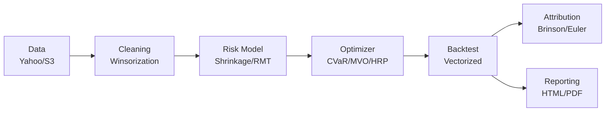

# GammaEdge


Portfolio optimization and backtesting framework implementing modern quantitative methods. Includes covariance shrinkage, Random Matrix Theory filtering, multiple optimization engines, and vectorized backtesting with realistic transaction costs.

The implementation prioritizes numerical stability and addresses common issues with sample covariance matrices in limited time series. We use a multi-step fallback approach for ill-conditioned matrices and apply spectral filtering to separate signal from noise.

---

## Features

### Risk Models
- Ledoit-Wolf and Oracle Approximating Shrinkage (OAS) for covariance estimation
- Random Matrix Theory (Marcenko-Pastur) eigenvalue denoising
- Black-Litterman framework with Idzorek's method for view incorporation

### Optimization
Seven optimizer implementations:
- **Mean-Variance**: Classic Markowitz with projected gradient descent
- **CVaR**: Conditional Value-at-Risk minimization via linear programming
- **Hierarchical Risk Parity**: Graph-based diversification without return forecasts
- **Risk Parity**: Equal risk contribution across assets
- **Tracking Error**: Minimize deviation from benchmark
- **Robust**: Uncertainty set-based optimization
- **Black-Litterman**: Bayesian combination of equilibrium and views

Constraint support: box limits, cardinality, sector exposure, turnover caps

### Backtesting
Vectorized backtesting engine with:
- Portfolio drift reconstruction between rebalances
- Transaction cost modeling (linear and non-linear)
- Almgren-Chriss square-root market impact
- Multiple rebalancing strategies (calendar-based, threshold-based)

### ML and Regime Detection
- Hidden Markov Models for regime identification
- XGBoost predictors with SHAP interpretability
- Fama-French 3 and 5-factor model integration

### Analytics
- Brinson-Fachler attribution (Allocation, Selection, Interaction)
- Euler risk contributions for marginal risk analysis
- Historical scenario analysis (2008 crisis, Covid-19)
- Standard metrics: Sharpe, Sortino, Calmar, VaR, CVaR, etc.

---

## Architecture



**Core libraries**: NumPy, SciPy, Polars, scikit-learn, statsmodels, hmmlearn, XGBoost  
**Interface**: Streamlit application with 8 pages, FastAPI backend

---

## Installation

```bash
git clone https://github.com/Claudoi/GammaEdge.git
cd GammaEdge
poetry install
poetry run streamlit run app/Home.py
```

## Example

```python
from portfolio.optim.cvar import solve_cvar_lp
from portfolio.features.risk_models import estimate_covariance, clean_covariance_rmt

# Covariance with shrinkage and RMT filtering
Sigma = estimate_covariance(returns, method="lw")
Sigma_clean = clean_covariance_rmt(Sigma, T=252, N=50)

# CVaR optimization (95% confidence)
weights = solve_cvar_lp(
    returns_matrix=returns,
    alpha=0.95,
    w_min=0.0,
    w_max=0.10
)
```

---

## Implementation Notes

**Numerical Stability**: Six-step fallback chain for singular matrices (spectral clipping, iterative jitter, ridge regularization, diagonal loading, pseudoinverse, identity fallback)

**RMT Filtering**: Eigenvalue separation based on Marcenko-Pastur distribution to filter noise from sample covariance

**Transaction Costs**: Square-root model with permanent and temporary impact components

**Testing**: 65%+ coverage on core portfolio modules, property-based testing with Hypothesis

---

## References

Based on methods from:
- Markowitz (1952): Portfolio Selection
- Ledoit & Wolf (2004): Honey, I Shrunk the Sample Covariance Matrix
- López de Prado (2016): Building Diversified Portfolios that Outperform Out of Sample
- Rockafellar & Uryasev (2000): Optimization of Conditional Value-at-Risk
- Almgren & Chriss (2001): Optimal Execution of Portfolio Transactions

---

**Author**: Claudio Martel  
**License**: MIT
